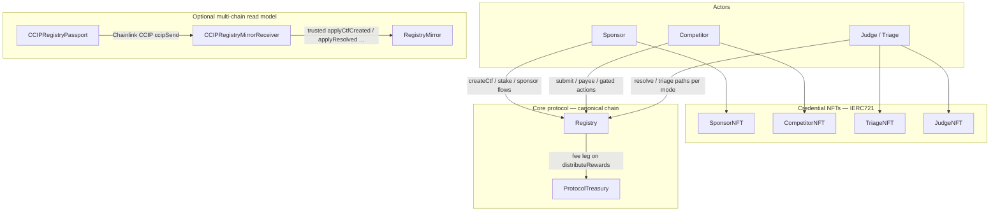

# CTFLand — overall summary (jury & contributor quickstart)

This document explains **how to run the web app** in **development** vs **production-style** mode, on **Linux, macOS, and Windows**, summarizes the **tech stack**, and sketches **how the core smart contracts fit together** (plus **why it matters**).

---

## What you get (impact)

| Theme | What CTFLand demonstrates |
|--------|---------------------------|
| **Fair play** | Collateral-backed challenges, credentialed judges/triage, on-chain lifecycle. |
| **Sybil resistance** | World ID + Competitor NFT gating for real humans in competitions. |
| **Multi-chain visibility** | Optional Chainlink CCIP path: canonical chain writes, peer chain **RegistryMirror** for read-consistent state (see `foundry/CROSS_CHAIN.md`). |
| **Hackathon-ready UX** | One-command (or double-click) frontend start after **Node.js 20+** — no Docker required for the UI. |

Smart contracts and deeper protocol notes live under **`foundry/`** and **`Pitch.md`**. This file focuses on **running the Next.js app** for demos and review.

---

## Tech stack (minimum to run the frontend)

| Requirement | Version / notes |
|-------------|-----------------|
| **Node.js** | **20.x or newer** (see `next-monorepo/package.json` `engines`). |
| **npm** | Comes with Node (project uses `npm@10.x` in the monorepo). |
| **Git** | To clone the repository. |

**Optional (only if you compile or deploy contracts):**

| Tool | Purpose |
|------|---------|
| **Foundry** (`forge`, `cast`) | Build/test/deploy Solidity in `foundry/`. |
| **Wallet + testnet AVAX/ETH** | Interact with deployed Fuji / Arbitrum Sepolia contracts. |

**Not required** to open the UI: PostgreSQL, Docker, or a separate backend server (the app uses Next.js API routes and env-based config where applicable).

---

## Scripts at a glance

All paths are relative to the **repository root** (`CTFLand/`).

| Goal | Linux / macOS / Git Bash | Windows (Command Prompt) | Windows (PowerShell) |
|------|---------------------------|----------------------------|----------------------|
| **Development** — hot reload, fast iteration | `./frontendDevMod.bash` | `frontendDevMod.cmd` | `.\frontendDevMod.ps1` |
| **Production-style** — full build, then `next start` | `./start_application.bash` | `start_application.cmd` | `.\start_application.ps1` |

**URLs:** default app URL is **`http://localhost:3000`** (Next.js).

**First-time env:** If `next-monorepo/apps/web/.env` is missing, scripts copy **`next-monorepo/apps/web/.env.example`** → `.env`. Edit at least **`NEXT_PUBLIC_RPC_URL`**, **`NEXT_PUBLIC_CHAIN_ID`**, and **`NEXT_PUBLIC_WALLETCONNECT_PROJECT_ID`** for wallet + chain behavior.

**Optional environment variables (bash only):**

| Variable | Effect |
|----------|--------|
| `CTFLAND_SKIP_INSTALL=1` | Skip automatic `npm install` when `node_modules` is missing. |
| `CTFLAND_SKIP_ENV_BOOTSTRAP=1` | Do not auto-copy `.env.example` to `.env`. |

---

## Platform-specific notes

### Linux & macOS

1. Install [Node.js 20+ LTS](https://nodejs.org/).
2. Clone the repo and `cd` into it.
3. One-time: `chmod +x start_application.bash frontendDevMod.bash` (optional).
4. Run `./frontendDevMod.bash` (dev) or `./start_application.bash` (prod-style).

### Windows — Command Prompt or double-click

1. Install **Node.js 20+ LTS** (add to PATH).
2. Clone the repo; open the folder in Explorer.
3. Double-click **`frontendDevMod.cmd`** (dev) or **`start_application.cmd`** (build + start).  
   If Windows warns about an unknown publisher, choose “Run anyway” or run from an elevated/Developer prompt as your policy allows.

### Windows — PowerShell

If execution policy blocks scripts:

```powershell
Set-Location path\to\CTFLand
powershell -ExecutionPolicy Bypass -File .\frontendDevMod.ps1
```

Same pattern for `start_application.ps1`.

### Windows — Git Bash (recommended if you already use Git for Windows)

Treat like Linux: `./frontendDevMod.bash` / `./start_application.bash` from the repo root.

### WSL (Windows Subsystem for Linux)

Use the **Linux** instructions inside the WSL distro; install Node inside WSL (not only on Windows) if you run the `.bash` scripts there.

---

## Protocol: smart contract interactions (high level)

On the **canonical** deployment, **`Registry`** is the hub for CTF lifecycle: creation, staking, finishing, resolution, punishment paths, and **`distributeRewards`** (splits to competitors, judges, optional triage, **`ProtocolTreasury`**). **NFT contracts** are gates and identities—not stand-ins for the Registry:

- **`SponsorNFT`** — tied to who can sponsor / create CTFs (flow depends on your deployed wiring).
- **`CompetitorNFT`** — competitors typically must hold a token (e.g. World ID–backed mint) to participate in gated actions.
- **`TriageNFT` / `JudgeNFT`** — credentials for triage / judge roles where the protocol checks them.

Staked value per CTF lives on **`Registry`** (`ctfStakedWei`, etc.); **`ProtocolTreasury`** receives the configured treasury fee slice when rewards are distributed.



**How CCIP fits:** **`Registry`** remains the **source of truth** for writes on the canonical chain. **`CCIPRegistryPassport`** is an **owner-controlled sender** that encodes mirror updates (see `MirrorPayloadCodec`); **`CCIPRegistryMirrorReceiver`** on the **peer** chain validates the CCIP message and calls **`RegistryMirror`**, which only accepts updates from that receiver (trusted executor). **Stake and native assets do not move through CCIP** in this design—only **mirrored state** for UIs and integrations.

The **Next.js app** talks to **`Registry`**, NFTs, treasury, and (when configured) passport/mirror addresses via the wallet—see **`contract-addresses.json`** / env in `apps/web`.

**Helper scripts** (`start_application.*`, `frontendDevMod.*`) only **bootstrap Node**, **`npm install`** in `next-monorepo/`, **`.env`**, and run **dev** or **build + start** for the web app—they do **not** deploy contracts.

---

## For hackathon juries (2-minute checklist)

1. Install **Node.js 20+**.
2. Clone the repository.
3. Run **`frontendDevMod`** for your OS (`.bash`, `.cmd`, or `.ps1`).
4. Open **`http://localhost:3000`**, connect a wallet, and walk through the demo path your team describes in **`Pitch.md`**.

If the build fails, ensure you are online for the first **`npm install`**, then retry.

---

## Related docs

| File | Content |
|------|---------|
| `Pitch.md` | Product story, modes, economics, demo talking points. |
| `foundry/CROSS_CHAIN.md` | Multi-chain / CCIP concepts. |
| `foundry/CCIP_DEPLOYMENT.md` | CCIP deploy runbook (optional for UI-only review). |
| `next-monorepo/apps/web/.env.example` | Required and optional public env vars for the web app. |

---

*CTFLand — verify, compete, ship.*
